Project Name: Implementing Jenkins Service in Kubernetes

Goals to reach:
1. Configure Jenkins service in Kubernetes in "devops" namespace
2. Create Jenkins pipeline that will:
    1. Build an Python based web application in the namespace of your choice.
    2. Deploy and run the web application in another namespace (not in the one the pipeline runs).

Prerequisites:
1. AWS EKS cluster with a node group with 2 nodes.
2. Docker Hub repository (for storing build images).

AWS EKS Architecture:
    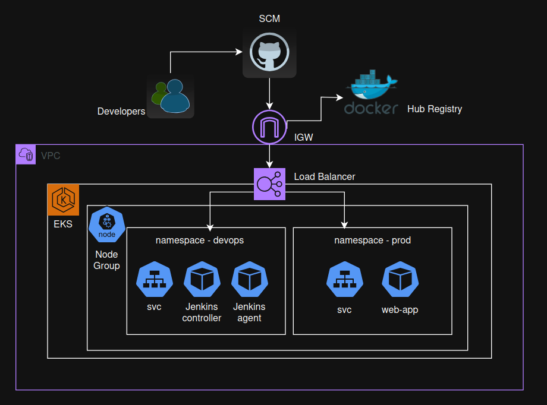

Step-by-Step Implementation:
1. Create an AWS EKS cluster with a node group with 2 nodes.
    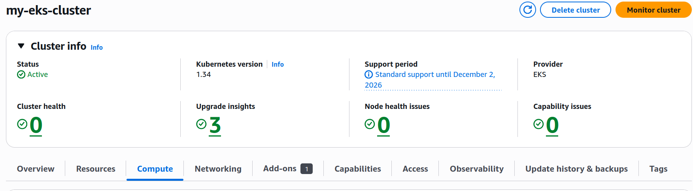
2. Set Role to the node group with the next policies: EKSWorkerNodePolice, EC2ContainerRegistryReadOnly and EKS_CNI_Policy. 
   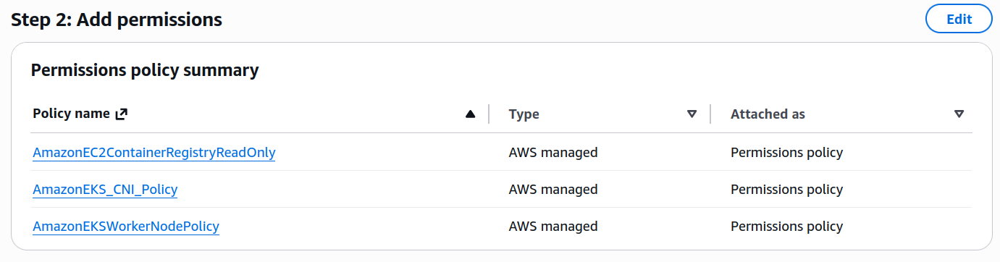
3. Check the Node creation:
   - kubectl get nodes
   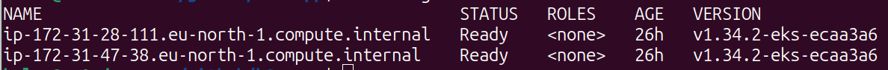
4. Create "devops" and "prod" namespaces:
   - kubectl create namespace devops
   - kubectl create namespace prod
5. Check the namespaces creation:
   - kubectl get ns
   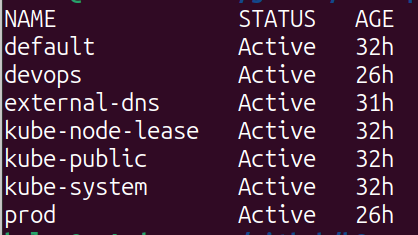
6. Create the following files in the k8s/devops directory:
   - jenkins-devops-rbac.yaml (Jenkins permissions in devops namespace)
   - jenkins-pvc.yaml (persistent storage for Jenkins controller)
   - jenkins-deployment.yaml (run the Jenkins controller)
   - jenkins-service.yaml (expose Jenkins controller)
7. Apply the files:
   - kubectl apply -f jenkins-devops-rbac.yaml
* Before running the jenkins-pvc.yaml -> create and apply a dedicated role for CSI Driver
* Role name: AmazonEKSPodIdentityAmazonVPCCNIRole with the next policies: AmazonEBSCSIDriverPolicy
  - kubectl apply -f jenkins-pvc.yaml
  - kubectl apply -f jenkins-deployment.yaml
  - kubectl apply -f jenkins-service.yaml
8. Get the Jenkins URL and password: kubectl get svc -n devops
    - get the EXTERNAL_IP and enter the jenkins UI http://<EXTERNAL_IP>
   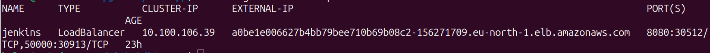
9. Get the Jenkins password:
    - kubectl get pods -n devops (get the pod name)
    - kubectl exec -n devops <pod_name> -- cat /var/jenkins_home/secrets/initialAdminPassword 
10. Enter and configure the Jenkins controller
11. Install plugins:
     - Kubernetes plugin 
     - pipeline plugin 
     - GitHub plugin
     - Git plugin
     - pipeline utility plugin
12. Set up Clouds in System Configuration:
    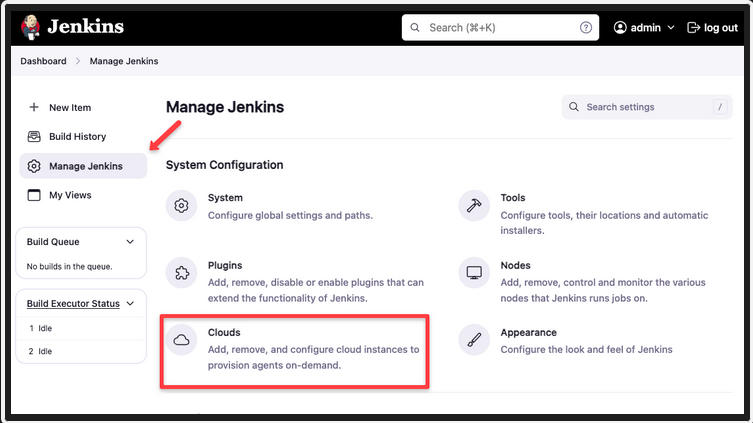
    - Name: kubernetes
    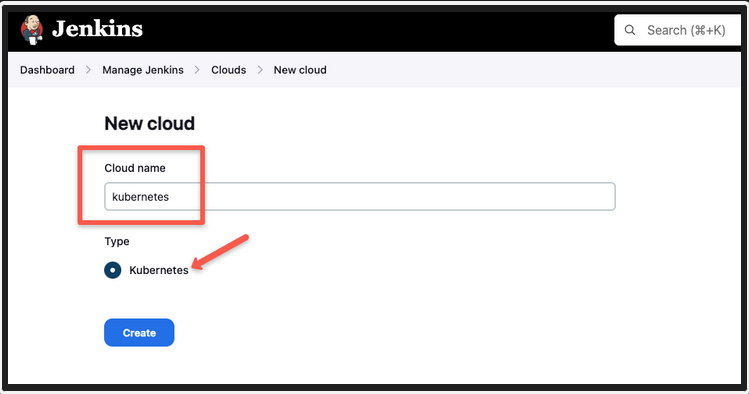
    - Namespace: devops
    - Jenkins URL: http://<EXTERNAL_IP>:8080
    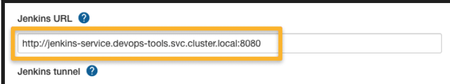
13. Configure Docker Hub credentials for storing and pulling Docker image of the web-app
    - Create an Access Token in the Docker Hub 
    - Create Global credentials in Jenkins controller (to pass it in the pipeline)
14. Create the following files in the k8s/prod directory:
    - app-deployment.yaml (runs the web-app)
    - app-service.yaml (expose the web-app)
    - jenkins-prod-rbac.yaml (Jenkins permission to deploy to prod namespace)
16. Create Jenkinsfile
17. Go to the Jenkins controller UI and implement manual trigger "Build now"
    * can be changed for the webhook trigger later
18. After the pipeline completed successfully, you can get the URL to access the web-app:
    - kubectl get svc -n prod
    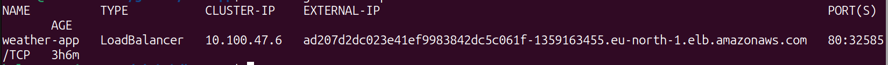
    - go to the http://<EXTERNAL_IP>
    - Enjoy the app =)
    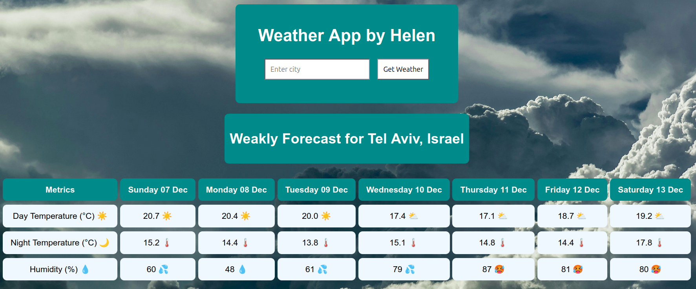
    